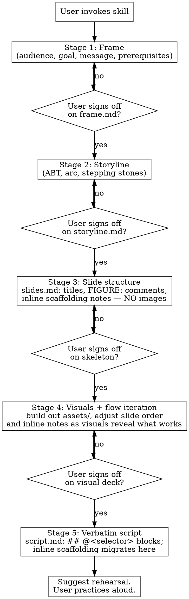

# Presentation Planning

## Overview

Develop a scientific talk through five sequential, reviewable stages — **Frame → Storyline → Slide structure → Visuals (with flow iteration) → Verbatim script** — producing an artifact at each stage. The slide deck is the *last* compiled artifact, not the first. Slide construction proceeds from a no-image skeleton, through visuals that co-evolve with the spoken flow, and finally to a verbatim `script.md` written once the deck is visually settled.

**Core principle: the talk is not the slides.** The talk is a spoken performance the speaker will rehearse; the slides are visual aids that support it. Skipping straight to slides optimizes the wrong artifact and produces word-heavy decks that duplicate what the speaker will say instead of supplementing it.

This skill is designed to be **collaborative by construction**: each stage ends at a checkpoint where the user reviews and refines the artifact before the next stage begins. No stage may be skipped, and no later stage may begin until the previous artifact exists and the user has signed off.

## When to Use

- User is preparing a scientific presentation and mentions Marp, slides, a talk, a seminar, a defense
- User has findings/results they need to turn into a talk
- User complains LLM-generated slides were word-heavy, non-collaborative, or template-y
- User wants to iterate on narrative/framing independently of slide design
- User is revising a talk they've given before for a new audience

**Don't use when:**
- User asks a one-off question about presentation technique (fonts, colors, timing) → answer directly, don't invoke the full skill

## The Iron Rule

**No slides until the prior stages have written artifacts.** Even if the user dumps a complete set of findings into the first message, even if they say "just give me a draft," do not skip Frame and Storyline. The things those stages capture — audience composition, goal, one-sentence core message, prerequisite knowledge the audience lacks — are the things the user has not articulated yet. A slide draft written without them will not be a useful stepping stone, it will be a distractor.

If the user pushes back with "I know the audience, just draft the slides," respond with the Frame questions as a single short interview (2–3 minutes of the user's time). The Frame file is then written from their answers. This is not bureaucracy — it is the difference between iterating on a talk and iterating on a document.

### First-turn discipline

**Your entire first-turn output is the Stage 1 Frame interview. Nothing else.** Do not additionally:

- Summarize your read of the user's message back to them.
- Propose a file layout or directory structure.
- Offer a tentative outline, slide count, or slide list "to calibrate expectations."
- Pre-fill the core-message sentence for the user. (They must write it themselves. If they cannot, that is *diagnostic* of the Frame not being done — do not paper over it by supplying a starter they can nod at.)
- Draft any slide, even as an illustrative example.

Adding "something tangible alongside the questions" is the most common first-turn loophole. Close it by giving nothing tangible until the Frame is signed off.

## Artifacts

All files live in a user-specified presentation directory (default: `./presentation/`). Ask the user at Frame-stage start where to save them and what the presentation is called.

| File | Stage | Content |
|------|-------|---------|
| `frame.md` | 1 | Audience composition, goal, one-sentence core message, prerequisite knowledge map |
| `storyline.md` | 2 | ABT core statement, narrative arc (hook → conflict → resolution), ordered beats with stepping stones that earn each prerequisite |
| `slides.md` | 3 | Marp skeleton: titles (short clauses), per-slide `<!-- _class: ... -->` directives, `FIGURE:` description comments, and inline `SPEAKER NOTES` / `TRANSITION IN/OUT` blocks as the primary note vehicle during construction. **No image tags yet.** |
| `slides.md` + `assets/` | 4 | Same `slides.md`, expanded: figure placeholders (``) and real visuals in the deck's `assets/` directory. Slide order, titles, and inline scaffolding notes are revised as visuals reveal what works. |
| `script.md` | 5 | Verbatim spoken script, routed to slides by `## @<selector>` blocks (`@slug` or `@a..b` ranges). Authored once the deck is visually settled; inline scaffolding notes migrate here in one pass. One block can cover several slides — that's the point. `(→)` markers are presenter cues. |
| `rehearsal-notes.md` | post-5 | User-written record of what felt off during rehearsal; seeds the next edit pass |

`slides.md` and `script.md` are the **canonical sources**; `build.sh` compiles them into the Marp deck (see Build system below). Until Stage 5, the canonical speaker notes are the inline `SPEAKER NOTES` / `TRANSITION IN/OUT` blocks on the slides themselves — `script.md` does not yet exist (or exists empty). At Stage 5 the inline scaffolding migrates into `script.md` as `## @<selector>` blocks, and from that point on `script.md` is the source of truth — same speaker note often attaches to several build-slides at once, and editing them in one place is the whole point.

## Build system

Two canonical files → one compiled output:

- **`slides.md`** — slide content. Each slide auto-gets a stable id from the slugified first heading; declare `<!-- _id: my-slug -->` near the heading to override (required when titles repeat without builds). Marp directives (`<!-- _class: ... -->`, `<!-- _backgroundColor: ... -->`, ...) are preserved. Once `script.md` exists, `<!-- @ author note -->` comments are stripped silently and any other inline HTML comment (including stray `SPEAKER NOTES` / `TRANSITION IN/OUT` blocks left over from Stage 3-4) is stripped *with a warning* (script.md is then the source of truth).
- **`script.md`** — verbatim spoken script as `## @<selector>` blocks. Selectors: `@slug` or `@slug-a..slug-b` (inclusive range in slides.md order), comma-separated. The block body becomes the note for every slide in the selection, so one block covers an arc of builds. `(→)` and `(play)` are presenter cues; preserved verbatim, ignored by the compiler. Authored at Stage 5 — until then, render the deck directly from `slides.md` (compiler emits a no-op if `script.md` is absent or empty).
- **`build.sh`** — compiles `slides.md` + `script.md` → `${OUTPUT_NAME}.md`, then renders HTML + PDF via Marp CLI. Override with `./build.sh -o other-name`.
- **`tools/compile.py`** — splicer (slides + script → Marp deck).
- **`tools/slide_summary.py`** — emits a one-line-per-slide index (id, title, image alts, video sources). Use this as the low-token agent overview of the deck.
- **`tools/script_format.py`** — validates selectors; reorders blocks to slides.md order; inserts `## @id` TODO blocks for any uncovered slide. `--dry-run` previews; `--init` scaffolds from scratch (use at Stage 5 start).

During Stages 3-4, run `./build.sh` after every edit to verify rendering; speaker notes are read off the inline scaffolding. At Stage 5, run `uv run tools/script_format.py --init` to scaffold `script.md` from current slide ids, then migrate inline notes into the blocks. After any later structural change to `slides.md`, run `uv run tools/script_format.py --dry-run` to surface broken selectors and apply the reorder without `--dry-run`.

## Core Loop



## Stages

Each stage has its own reference guide. Read the relevant reference before starting a stage.

### Stage 1: Frame
**Output:** `frame.md`

Copy the template into the presentation directory at the start of the stage, then fill in the bracketed placeholders as the interview proceeds:

```
cp <skill-dir>/assets/frame.md.template <presentation-dir>/frame.md
```

Interview the user to capture four things. Use `references/frame-guide.md` for the full elicitation script.

1. **Audience composition** — not "faculty" but "who specifically sits in the room; which subfields; which are expert vs. generalist in *this* topic."
2. **Goal** — what the user wants this talk to accomplish (job talk signaling, thesis committee buy-in, collaborator recruitment, etc.).
3. **Core message** — one sentence the user wants every audience member to remember. If the user can't state it, the talk isn't ready — iterate until they can.
4. **Prerequisite knowledge map** — the minimum set of concepts the audience must hold to land the core message. For each concept: does the audience already have it, or must the talk build it? The build list feeds directly into Stage 2.

### Stage 2: Storyline
**Output:** `storyline.md`

Copy the template at the start of the stage:

```
cp <skill-dir>/assets/storyline.md.template <presentation-dir>/storyline.md
```

Read `references/storyline-guide.md`. Produce:

1. **ABT core statement** (AND / BUT / THEREFORE — Olson, via Crivellaro).
2. **Arc outline** — hook, conflict, **question pivot**, resolution, meaning. The Question Pivot is one slide / ~30 s where the speaker explicitly names the question they went after — required for any first-person research talk (job talk, defense, seminar, lab meeting, conference talk). Skip only for pure tutorial/review/meta talks. The resolution decomposes into one or more "data dives," each a mini-argument (sub-question → one piece of evidence → one-sentence result → bridge). Let the core claim's structure determine the count — one dive if the talk rests on a single body of evidence, more as the argument actually splits. Do not hit a 3–5 quota just because it is typical.
3. **Stepping stones** — for each prerequisite from the Frame, specify *where in the narrative it gets earned as forward motion*, not as "Background" filler. Every concept the audience will encounter must be introduced as a step of the argument before it is relied on.
4. **Order check** — does the narrative run chronologically ("we did X, then Y failed, so we did Z")? If yes, re-plan. Lab-notebook order is the #1 failure mode; flashback/novel order holds attention.

### Stage 3: Slide structure (skeleton)
**Output:** `slides.md` — titles, `FIGURE:` comments, inline scaffolding notes, no image tags

Read `references/marp-conventions.md`. Convert the storyline into a no-image Marp skeleton focused on the **spoken performance**.

**Copy the locked-in visual style, tools, and build wiring at the start of Stage 3** so the deck is renderable from the first slide:

```
cp -r <skill-dir>/assets/themes                  <presentation-dir>/themes
cp -r <skill-dir>/assets/tools                   <presentation-dir>/tools
cp    <skill-dir>/assets/marprc.yml.template     <presentation-dir>/.marprc.yml
cp    <skill-dir>/assets/build.sh.template       <presentation-dir>/build.sh
cp    <skill-dir>/assets/slides.md.template      <presentation-dir>/slides.md
cp    <skill-dir>/assets/marp-video-controls.js  <presentation-dir>/marp-video-controls.js
chmod +x <presentation-dir>/build.sh
```

`script.md` is **not** copied yet — it's authored in Stage 5. Edit `build.sh` to set `OUTPUT_NAME` to the presentation name. See **Locked-in visual style** below. Do not re-author the theme/tools wiring.

In `slides.md`, each slide gets:

| Field | Content |
|-------|---------|
| Title | A single short directive clause naming what the slide shows. See `references/marp-conventions.md` ("The title"). |
| Figure slot | An HTML-comment `FIGURE:` description: what the figure should show, what axes, what the audience should look at first. No image tag yet. |
| Inline scaffolding | An HTML comment block containing `SPEAKER NOTES` (2–4 bullets) and `TRANSITION IN:` / `TRANSITION OUT:` sentences. This is the primary note vehicle during construction — it lives on the slide so the spoken frame is visible alongside the slide's content. It migrates to `script.md` at Stage 5. |
| Id (optional) | `<!-- _id: my-slug -->` if the auto-id from the title is awkward, or if multiple slides share a title (build sequences need explicit ids on at least one). |

One message per slide. If a slide is carrying two takeaways, split it.

### Stage 4: Visuals and flow iteration
**Output:** same `slides.md`, expanded — plus the deck's `assets/` directory populated with figures and videos

Now build out visuals. Unlike the prior structure-only pass, slide order, titles, and inline scaffolding notes are **explicitly in scope to revise here** — visuals reveal mismatches that the storyline-on-paper couldn't surface (a figure carries two takeaways and the slide needs to split; a transition sentence stops working once the audience can see the image; a dive needs an extra setup slide). Co-iterate.

- Replace each `FIGURE:` comment with a placeholder image tag: ``. Keep the description directly below the tag so the user knows what to produce. Visuals live in the deck's `assets/` directory.
- Add progressive-reveal markers where the storyline calls for build-up: duplicate slides (Pattern A) or annotate with `<!-- BUILD: ... -->` comments (Pattern B). See `references/marp-conventions.md`.
- Check sizing hints, per-slide class directives (dark backgrounds for microscopy, etc.), and the summary/acknowledgments slides.
- Adjust the inline scaffolding notes as flow changes. The spoken frame stays in sync with the visible deck through this stage.
- Do not invent figure content. Every figure is a placeholder the user supplies (or a render script you've been pointed at).
- Run `./build.sh` regularly to verify rendering. The compiler treats inline scaffolding as canonical until `script.md` exists.

### Stage 5: Verbatim script
**Output:** `script.md` — the spoken script as `## @<selector>` blocks

Once the visual deck is settled, write the verbatim script. Migrate the inline scaffolding into `script.md` in one pass; from this point on, `script.md` is the source of truth and any inline blocks left in `slides.md` are stripped at compile time with a warning.

```
uv run tools/script_format.py --init     # scaffolds script.md with one TODO block per slide id
```

(`assets/script.md.template` is a conventions reference, not a starter file — `--init` writes the scaffold directly from the current `slides.md`.)

For each `## @<selector>` block:
- Body is the prose the speaker reads aloud while the named slide(s) are on screen.
- `(→)` marks where the presenter advances (rehearsal cue; compiler ignores).
- `(play)` marks an in-slide video trigger (presenter cue; compiler ignores).
- `TRANSITION IN:` / `TRANSITION OUT:` lines at block boundaries are the sentences the speaker says entering and leaving the arc.
- Merge adjacent blocks into ranges (`## @a..d`) where the same prose covers a continuous build sequence.

When the migration is complete, delete the inline `SPEAKER NOTES` / `TRANSITION IN/OUT` comments from `slides.md`. Run `./build.sh` to confirm the compiled deck reads from `script.md`.

After Stage 5, **suggest** (do not require) that the user rehearse the talk out loud, time it, and note what felt off. This seeds `rehearsal-notes.md` and the next edit pass.

## Backup slides

Slides placed after the acknowledgments are a normal, expected part of a talk — held in reserve for anticipated audience questions. Zero is fine, ten is fine. Give each an explicit `<!-- _id: backup-... -->` so the slug is stable and obviously off-flow. Titles don't need a special prefix.

When a slide in the main flow feels tacked-on in rehearsal, demoting it to a backup is usually better than deleting it — narrative clarity wins, and the figure is still there if asked.

## Close the loop on every change

Whenever you edit a figure-producing script (e.g. a render script that emits PNG/MP4 assets), `slides.md`, or `script.md`, run the regeneration AND the deck build before handing back, so the user can review the rendered artifact rather than the diff:

1. If you edited a render/asset script: run it (`uv run scripts/<...>.py` or whatever entry point the project uses) so the on-disk asset reflects the change.
2. If you added or removed slides in `slides.md` **and `script.md` already exists** (Stage 5 onward): run `uv run tools/script_format.py --dry-run` to see which `script.md` blocks need re-routing, then run without `--dry-run` to apply the reorder and seed TODO blocks for new gaps. Before Stage 5 this is a no-op — `script.md` doesn't exist yet.
3. If you edited `slides.md`, `script.md`, or any asset that the deck embeds: run `./build.sh` from the presentation directory to regenerate the compiled `.md`, PDF, and HTML.
4. If a step fails, debug it — do not punt the failure back to the user with "please re-run X."

This applies to all edits during Stages 3–5 and post-rehearsal iteration. Stopping at "edits applied" forces the user to do the mechanical regen step themselves; that is the failure mode this rule exists to prevent.

## Rationalizations That Skip Stages

From baseline testing, these are the specific arguments a capable LLM uses to skip Frame and Storyline. Do not accept them.

| Rationalization | Reality |
|-----------------|---------|
| "The user gave enough detail to draft slides." | The detail they gave is raw material. The things Frame captures — audience, goal, core message, prerequisite map — are things they haven't articulated yet, not things they left out of the prompt. |
| "They asked for a first-pass draft to iterate on." | A slide draft without a storyline is not a stepping stone — it is a distractor that shifts iteration onto slide-level details before the narrative is settled. |
| "I can infer the audience from the context." | You cannot infer which *subset* of the audience is expert in the user's specific subfield. Ask. |
| "I'll produce slides and they'll tell me what to change." | The user explicitly asked for a collaborative process. Slides-then-edit is the failure mode they're trying to escape. |
| "Frame takes too long — just start." | Frame is 4 questions. It takes the user 3 minutes. The talk takes a month. |
| "The ABT statement is obvious from the abstract." | If the user hasn't said it, it isn't settled. Make them say it. Offering a starter they can rubber-stamp is the same failure in a softer wrapper. |
| "Holding the reply for questions trades user momentum for process purity." | User momentum on the wrong artifact is worse than a 3-minute pause to set the right one. The questions *are* the momentum. |
| "I can ask the questions *and* draft a rough deck as a courtesy." | The hybrid move. No. The deck is what the Frame answers will reshape; drafting it now produces work to throw away and anchors the user to your structure. |

## Red Flags — Stop and Restart the Current Stage

- You wrote a slide before `storyline.md` exists.
- You wrote an outline that starts "Background:" or "Methods:" or proceeds in experiment chronology.
- A slide title is a vague catch-all ("Results", "Benchmarks") or a full declarative sentence that wraps to two lines ("Protein X represses Gene Y in postmitotic neurons, as shown by qPCR"). Aim for a short directive clause ("Protein X represses Gene Y").
- A slide has more than one takeaway.
- A concept appears on a slide without having been earned earlier in the storyline.
- A slide has no spoken frame on it (no inline scaffolding in Stages 3-4; no `script.md` block in Stage 5+).
- You added image tags during Stage 3 (visuals belong to Stage 4).
- You wrote `script.md` before the visual deck was signed off (script belongs to Stage 5, after flow has stabilized against real visuals).
- For a first-person research talk: there is no Question Pivot slide between the Conflict beat and the first data dive. The audience never gets the cue that the contribution has begun.

## Common Mistakes

| Mistake | Fix |
|---------|-----|
| Collapsing Frame and Storyline into one dialog | Two separate artifacts. The Frame settles constraints; the Storyline spends them. Mixing them loses the constraint check. |
| Writing prose in `storyline.md` | Bullets and one-sentence beats. Prose belongs in rehearsal, not planning. |
| Inventing figure content in `slides.md` | Placeholders only. The user supplies actual figures. |
| Adding a "Background" slide | Prerequisites are earned as stepping stones within the forward narrative, not dumped as setup. Rework the storyline. |
| Forgetting the spoken frame | Inline scaffolding `SPEAKER NOTES` / `TRANSITION IN/OUT` is a first-class output at Stage 3, not an afterthought. Without it the skeleton is just titles. |
| Slide titles that fail the title rules (long sentences, two clauses, "E.g." prefixes, vague catch-alls) | See `references/marp-conventions.md` ("The title") for the canonical rules and good/bad examples. |
| Writing `script.md` during Stage 3 or 4 | The script is Stage 5. During construction the canonical notes live inline on the slides. Writing the verbatim script before visuals settle produces script you'll throw away when the flow shifts under you. |
| Leaving inline scaffolding in `slides.md` after Stage 5 | Once `script.md` exists, the inline `SPEAKER NOTES` / `TRANSITION IN/OUT` blocks should be deleted from `slides.md`. `compile.py` strips any that remain with a warning — `script.md` is the source of truth from Stage 5 onward. |
| Repeating the same speaker note inline across every build slide of a sequence | Acceptable during Stages 3-4 (scaffolding); at Stage 5 collapse into a single `## @first-build..last-build` block. One block, many slides. |
| Prescribing home slides universally | Home slides help long talks with clearly separable sections. For shorter or single-thread talks, verbal signposting suffices. Use the principle, not the device. |
| Auto-rehearsing for the user | Rehearsal is the user's job. The skill suggests, does not block. |

## Skill Dependencies

- `manuscript-planning` / `literature-review` — if the talk is built from a manuscript or literature that lives in the codebase, read those artifacts for context before Frame

## References

- `references/principles.md` — the seven principles across Naegle, McConnell, Alley, Alon, Tufte, Doumont, Crivellaro, Kenny
- `references/frame-guide.md` — Stage 1 elicitation script
- `references/storyline-guide.md` — Stage 2 narrative craft
- `references/marp-conventions.md` — Stages 3–5: Marp syntax, slide titles, the spoken frame (inline scaffolding and `script.md` blocks), figure placeholders, fragments, videos

## Asset templates

Each stage has a template in `assets/` that shows the expected shape of the output file. Copy the template to the user's presentation directory at the start of the stage, then fill in the bracketed placeholders from what the user and you have produced together.

- `assets/frame.md.template` — Stage 1 skeleton
- `assets/storyline.md.template` — Stage 2 skeleton
- `assets/slides.md.template` — Stages 3 and 4: Marp skeleton with frontmatter, title slide, per-slide title/figure/scaffolding-notes pattern, `FIGURE:` placeholders for Stage 3, summary, and acknowledgments.
- `assets/script.md.template` — Stage 5 conventions reference for `script.md` (block-routing syntax, presenter cues). At Stage 5, do **not** copy this file — run `tools/script_format.py --init` to scaffold directly from current slide ids. The template is documentation, not a starter file.
- `assets/tools/` — `compile.py`, `slide_summary.py`, `script_format.py`, `parser.py`. Copy the whole directory verbatim into `<presentation>/tools/`. PEP 723 inline-script style — `uv run` resolves deps.
- `assets/themes/` — locked-in visual style (Flexoki + Inter); copy verbatim to `<presentation>/themes/`
- `assets/marprc.yml.template` — marp-cli config; copy to `<presentation>/.marprc.yml`
- `assets/build.sh.template` — compile + render driver; copy to `<presentation>/build.sh` (and `chmod +x`). Edit `OUTPUT_NAME` to the presentation name.
- `assets/marp-video-controls.js` — JS controller for `data-play-from-start` / `data-play-then-advance` video attributes; copy to `<presentation>/marp-video-controls.js`. See `references/marp-conventions.md` (Animated figures).

## Locked-in visual style

The skill ships a fixed visual identity (Flexoki palette + Inter typeface) so every presentation looks the same on every rendering machine, without per-talk CSS authoring. The Stage 3 copy block above wires it in; do not author per-talk themes or swap fonts. See `references/marp-conventions.md` ("Locked-in visual style") for the canonical reference, and `assets/themes/README.md` for what ships alongside each deck.

## Session Start

When invoked, the agent should:

1. Check whether any of the artifact files (`frame.md`, `storyline.md`, `slides.md`, `script.md`, `rehearsal-notes.md`) already exist in the current directory or a user-specified subdirectory.
2. If **resuming**: read existing artifacts. Run `uv run tools/slide_summary.py slides.md` (if `slides.md` exists) to get a low-token deck overview before re-reading any larger file. Identify the current stage from what's on disk:
   - `slides.md` exists, no image tags → Stage 3.
   - `slides.md` has image tags but no `script.md` → Stage 4.
   - `script.md` exists → Stage 5 or later.

   Summarize current stage and ask what to work on.
3. If **starting fresh**: ask the user what the talk is (occasion, approximate length, approximate date) and where to save the artifacts. Then begin Stage 1.
